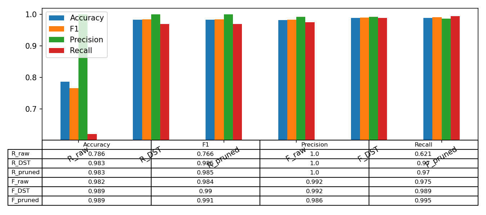

# DST – Rule‑Based Classification with RIPPER / FOIL + Dempster‑Shafer Theory

<p align="center">
  
</p>

> • Automatic rule induction (RIPPER / FOIL)  
> • Dempster‑Shafer evidence aggregation & mass optimisation  
> • Post‑pruning that keeps the model tiny without hurting accuracy  

---

## 1 · Quick start


git clone https://github.com/SargisVardanian/DST.git
cd DST
python test_Ripper_DST.py    # full benchmark pipeline

`test_Ripper_DST.py` will:

1. learn rules with **RIPPER** and **FOIL**;
2. convert them to Dempster‑Shafer rules;
3. optimise masses via gradient descent, optionally prune;
4. save everything as portable `.dsb` files and dump the plots / CSV metrics.

---

## 2 · Project layout

```
core.py                   # helper maths (mass initialisation, commonalities, …)
utils.py                  # misc helpers (I/O, plotting, …)
DSRule.py                 # light wrapper around a Python predicate + caption
DSRipper.py               # incremental RIPPER/FOIL rule inducer
DSModel.py                # single‑class  DST model
DSModelMultiQ.py          # multi‑class   DST model
DSClassifier.py           # sklearn‑style wrapper (binary)
DSClassifierMultiQ.py     # sklearn‑style wrapper (multi‑class)
Datasets_loader.py        # 6 toy+real binary datasets used in benchmarks
test_Ripper_DST.py        # end‑to‑end experiment / plotting script
```

---
## 3 · Rule induction with **DSRipper**

### 3.1 Algorithm in a nutshell

Classical **RIPPER** loop \[Cohen 1995\]:

1. **Grow**: add a literal that maximises information‑gain  
   ```math
   \mathrm{Gain}(r)
   = p_{\mathrm{new}}
     \Bigl(
       \log_{2}\!\frac{p_{\mathrm{new}}}{p_{\mathrm{new}} + n_{\mathrm{new}}}
       \;-\;
       \log_{2}\!\frac{p_{\mathrm{old}}}{p_{\mathrm{old}} + n_{\mathrm{old}}}
     \Bigr)

2. **Prune** the rule by reduced‑error pruning on a held‑out split.

3. **Delete** positives covered by the rule & repeat until no positives remain.

`DSRipper` supports two modes:

| `algo` value | Gain expression                                                                                                      |
| -----------: | :------------------------------------------------------------------------------------------------------------------- |
|   `"ripper"` | same as above                                                                                                        |
|     `"foil"` | $\mathrm{FOILGain} = p \,\bigl(\log_2 t' - \log_2 t\bigr),$ where \$p\$ = #positives covered, \$t\$ = total covered. |

Induction runs **incrementally in mini‑batches**, so large datasets (e.g. 6 k wine rows) fit in memory.

### 3.2 Output

For each class \$c\$ we get a Python `dict`, e.g.:


{'free sulfur dioxide': ('<', 36),
 'total sulfur dioxide': ('>=', 110)}

Converted to a `DSRule`:

```python
lam  = lambda x, op='<', thr=36: x[idx] < thr
rule = DSRule(
    ld=lam,
    caption="Class 1: free SO₂ < 36 & total SO₂ ≥ 110"
)
```

At this stage each rule knows only **coverage** \$|{x : R(x)}|\$. All other quality metrics come later via DST.

---

## 4 · Dempster‑Shafer model

### 4.1 Mass Assignment (MAF)

Each rule \$R\_i\$ carries a mass vector

```math
\mathbf m^{(i)} = 
\bigl(m_1^{(i)},\,\dots,\,m_K^{(i)},\,m_{\mathrm{unc}}^{(i)}\bigr),
\quad
\sum_{j=1}^K m_j^{(i)} + m_{\mathrm{unc}}^{(i)} = 1.
```

Initialisation: either “uniform + 0.8 uncertainty” or smarter clustering‑based (see **DSGD++**).

### 4.2 Combination → Commonality space

For sample \$\mathbf x\$ let

```math
\mathcal R(\mathbf x) = \{\,i \mid R_i(\mathbf x) = \mathrm{True}\}.
```

| Step             | Formula                                                                                                                                                           |
| ---------------- | ----------------------------------------------------------------------------------------------------------------------------------------------------------------- |
| **Commonalities**| $$q_k^{(i)} = m_k^{(i)} + m_{\mathrm{unc}}^{(i)}, \quad \forall\,k=1,\dots,K$$                                                                                     |
| **Product rule** | $$q_k(\mathbf{x}) = \prod_{\,i\in\mathcal{R}(\mathbf{x})} q_k^{(i)}$$                                                                                              |
| **Normalise**    | $$\displaystyle \hat m_k(\mathbf{x}) = \frac{q_k(\mathbf{x})}{\sum_{\ell=1}^K q_\ell(\mathbf{x})}, \quad \hat m_{\mathrm{unc}}(\mathbf{x}) = 0$$                 |                                                                                    |
```math
Prediction = \arg\max\_k \hat m\_k(\mathbf x).
```
### 4.3 Mass optimisation (DST‑GD)

Treat every \$\mathbf m^{(i)}\$ as a learnable tensor and minimise cross‑entropy (or MSE) with Adam.
Constraints (\$m\ge0\$, sum to 1) are enforced in `DSModel*.normalize()`.

---

## 5 · Rule quality & pruning

After optimisation each rule \$R\_i\$ has:

| Metric          | Expression                                                                  |
| :-------------- | :-------------------------------------------------------------------------- |
| **Uncertainty** | \$u\_i = m\_{\mathrm{unc}}^{(i)}\$                                          |
| **Top‑2 ratio** | \$r\_i = \dfrac{\max\_j,m\_j^{(i)}}{\text{2nd-largest }m^{(i)} + 10^{-3}}\$ |

Min‑max normalise \$r\_i \to r'\_i \in \[0,1]\$ and compute **usefulness**:

$$
H_i = \frac{2\,(1 - u_i)\,r'_i}{(1 - u_i) + r'_i}.
$$

Re‑compute coverage \$c\_i = |{,\mathbf x : R\_i(\mathbf x)}|\$.
**Drop** rule \$R\_i\$ if **all** hold:

* \$u\_i > 0.7\$
* \$H\_i < 0.4\$
* \$c\_i < 10\$

*Wine* dataset: rules ↓ **42 → 33** with identical F1.

---

## 6 · Benchmarks

| Variant       |  Acc. |   F1  | Prec. |  Rec. |
| :------------ | :---: | :---: | :---: | :---: |
| **R\_raw**    | 0.786 | 0.766 | 1.000 | 0.621 |
| **R\_DST**    | 0.983 | 0.988 | 1.000 | 0.970 |
| **R\_pruned** | 0.983 | 0.985 | 1.000 | 0.970 |
| **F\_raw**    | 0.982 | 0.984 | 0.992 | 0.975 |
| **F\_DST**    | 0.989 | 0.990 | 0.992 | 0.989 |
| **F\_pruned** | 0.989 | 0.991 | 0.986 | 0.995 |

> **DST weighting** lifts plain RIPPER from mediocre to *SOTA*.
> **Pruning** shrinks the model by ≈ 20 % with no loss in performance.

---

## 7 · Citing & further reading

* G. Shafer — *A Mathematical Theory of Evidence* (Princeton U Press, 1976)
* W. Cohen — *Fast Effective Rule Induction* (ICML, 1995)
* R. Quinlan — *FOIL: A Midterm Report* (ICML tutorial, 1990)
* S. Peñafiel et al. — *Applying Dempster‑Shafer Theory for Developing a Flexible, Accurate and Interpretable Classifier* (ESWA, 2020)
