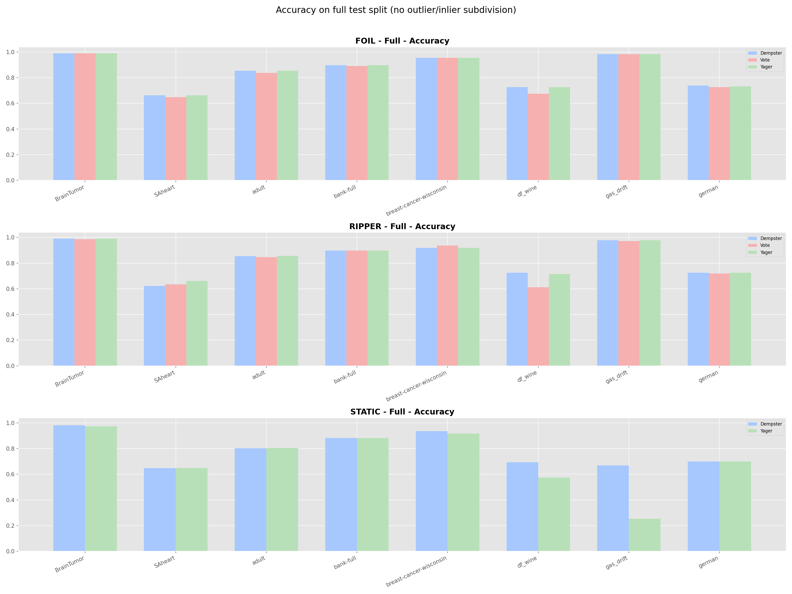

# DST: Interpretable Rule-Based Classification via Dempster-Shafer Theory

<p align="center">
  
  
</p>

## Abstract

This repository implements an interpretable classification framework that combines **symbolic rule-based models** with **Dempster-Shafer Theory (DST)** and gradient-based optimization.

Classic rule learners such as **RIPPER** and **FOIL** produce human-readable IF–THEN rules, but they are rigid and lack calibrated uncertainty. On the other hand, modern probabilistic models are accurate but often opaque.

Our framework bridges this gap:

- Logical rules are treated as **sources of evidence**
- Each rule has a learnable **mass function** over classes + uncertainty
- Evidence from multiple rules is aggregated via **Dempster's rule**
- Masses are optimized by **Dempster-Shafer Gradient Descent (DSGD)**

We support three rule generation strategies — **RIPPER**, **FOIL**, and **STATIC** — and show how DST turns them into robust, differentiable classifiers with explicit epistemic uncertainty.

We provide two mass initialization modes: a **normal** random init with base uncertainty (e.g., 0.8), and **DSGD++-style** initialization which estimates a rule’s dominant class from the training samples it covers (coverage × purity / representativeness) and assigns the remaining mass to Ω. This initialization does **not** require storing a hard class label inside the rule itself (so it also applies to STATIC predicates).

---

## 1. Theoretical Framework

### 1.1 Dempster-Shafer Theory of Evidence

For a classification task with classes $\Theta = \{C_1, C_2, \dots, C_K\}$, DST defines a **mass assignment function** $m$ over subsets of $\Theta$:

$$\sum_{A \subseteq \Theta} m(A) = 1, \qquad m(\emptyset) = 0$$

Unlike Bayesian probability, DST allows mass on **non-singleton** sets:

- Mass on $\{C_1\}$ is belief specifically in class $C_1$
- Mass on $\Theta$ (denoted $\Omega$) models **pure ignorance**

In this project we follow a common simplification — we only assign masses to **singletons** and the **universal set** $\Omega$:

$$\mathbf{m} = [m_1, m_2, \dots, m_K, m_\Omega]$$

where $m_k = m(\{C_k\})$ and $m_\Omega = m(\Theta)$. For each rule $r_i$ we maintain such a vector $\mathbf{m}^{(i)}$ — these are the parameters the model learns.

### 1.2 Dempster's Rule of Combination

Given two rules with mass functions $m^{(1)}$ and $m^{(2)}$, Dempster's rule combines them:

$$(m^{(1)} \oplus m^{(2)})(A) = \frac{1}{1 - K} \sum_{B \cap C = A} m^{(1)}(B) \, m^{(2)}(C)$$

where the **conflict** $K$ is:

$$K = \sum_{B \cap C = \emptyset} m^{(1)}(B) \, m^{(2)}(C)$$

In our singletons+Ω setting:

- Mass on each class $C_k$ is proportional to both rules supporting $C_k$, or one rule supporting $C_k$ while the other is ignorant (Ω)
- Mass on Ω is proportional to both rules being ignorant
- Conflict $K$ arises when rules support **different classes simultaneously**; normalization by $1 - K$ redistributes this conflict

The code for batched pairwise combination is in `core.py` (`ds_combine_pair`), with a vectorized wrapper `_combine_active_masses` in `DSModelMultiQ`.

### 1.3 From Masses to Probabilities

We convert masses $\mathbf{m}$ to probabilities $p$ using:

1. **Pignistic transform** (uniformly spreading $m_\Omega$ across classes):
   $$p_k = m_k + \frac{m_\Omega}{K}$$

2. **Class-prior-based redistribution** (optional): distribute ignorance proportionally to class priors $\pi$:
   $$p_k = m_k + m_\Omega \cdot \frac{\pi_k}{\sum_j \pi_j}$$

This is implemented in `DSModelMultiQ._mass_to_prob` and `core.masses_to_pignistic`.

---

## 2. Model Architecture

The end-to-end classifier has three layers:

1. **Rule Generation** (`rule_generator.py`) — RIPPER / FOIL / STATIC learn symbolic rules from `(X, y)`
2. **DST Model** (`DSModelMultiQ.py`) — stores rules, evaluates activations, maintains per-rule mass vectors, combines masses via Dempster's rule, outputs class probabilities
3. **Training Loop** (`DSClassifierMultiQ.py`) — splits data, calls rule generator, initializes masses, trains via projected gradient descent

### 2.1 Rule Generation Strategies

All strategies operate on a shared representation:

- A **literal** is a simple condition `(feature, operator, threshold/value)`: numeric (`Vj < t`, `Vj > t`) or categorical (`Vj == value`)
- A **rule** is a conjunction of literals: IF $\ell_1 \land \ell_2 \land \dots \land \ell_L$ THEN class $c$ (for RIPPER/FOIL). For STATIC, rules are **unlabeled predicates**; their class support is expressed only through the learned mass vector.

#### 2.1.1 FOIL (First Order Inductive Learner)

FOIL is a classic **top-down** rule learner (Quinlan, 1990):

1. Start with an empty rule (covers everything)
2. Iteratively add literals to maximize **FOIL-Gain**:
   $$Gain = t \cdot \left(\log_2\frac{p_1}{p_1 + n_1} - \log_2\frac{p_0}{p_0 + n_0}\right)$$
   where $p_0, n_0$ are positives/negatives before, $p_1, n_1$ after, and $t$ is covered positives
3. Stop when rule covers zero negatives
4. Remove covered positives; repeat

**Characteristics:**
- ✅ Generates **specific** rules with high precision
- ✅ Good at catching "edge cases"
- ❌ No pruning phase → prone to overfitting

#### 2.1.2 RIPPER (Repeated Incremental Pruning)

RIPPER (Cohen, 1995) adds critical **pruning**:

1. **Grow Phase:** On Grow Set, add literals with FOIL-gain until rule is pure
2. **Prune Phase:** On Prune Set, remove literals from end if it improves:
   $$Score = \frac{p - n}{p + n}$$
3. **Optimization Phase:** Rewrite/replace rules using MDL criterion

**Our Extension: Tiered Precision RIPPER**

```python
precision_tiers = [
    {"min_precision": 0.80, "max_literals": 8},
    {"min_precision": 0.60, "max_literals": 6},
    {"min_precision": 0.40, "max_literals": 5},
    {"min_precision": 0.20, "max_literals": 4},
]
```

- First grow very precise (but narrow) rules
- Then allow less precise rules with limited length
- For DST: high-precision rules provide strong evidence; lower-precision rules add weak but useful signals

#### 2.1.3 STATIC (Exhaustive Heuristic Search)

STATIC casts a "wide net" by combining simple candidates:

1. **Single literals:** Quantile thresholds for numeric, frequent values for categorical
2. **Pairs and triples:** Combine best literals into 2-3 condition rules
3. **Diversity filter:** Remove highly overlapping rules (Jaccard similarity)

**Result:** Hundreds (sometimes 1000+) rules including feature interactions. Noisy rules are naturally suppressed by DST — they learn high $m_\Omega \approx 1$ and contribute little.

#### 2.1.4 Strategy Comparison

| Aspect | RIPPER | FOIL | STATIC |
|:-------|:-------|:-----|:-------|
| **Strategy** | Grow-Prune-Optimize | Greedy FOIL-gain | Exhaustive heuristic |
| **Rule Count** | Low (20-150) | Medium (100-400) | High (400-1200) |
| **Overfitting** | Resistant | Prone | N/A |
| **Best For** | Clean, high-signal | Balanced data | Noisy, interaction-heavy |

### 2.2 DST Layer (DSModelMultiQ)

`DSModelMultiQ.py` implements:

1. **Feature encoding:** Numeric as-is, categorical via internal encoders
2. **Literal evaluation:** `_eval_literals(X)` → boolean masks for all literals
3. **Rule activation:** `_activation_matrix(X)` → matrix $A[n,r] = 1$ if rule $r$ fires on sample $n$
4. **Mass parameterization:** `rule_mass_params` matrix $[N_{rules}, K+1]$, projected to simplex via `params_to_mass`
5. **Combination:** `_combine_active_masses` applies Dempster's rule to active rules only
6. **Probabilities:** `_mass_to_prob` applies pignistic transform or class-prior redistribution

### 2.3 Mass Initialization: Normal vs DSGD++

**Normal initialization** (`reset_masses`):
- Random masses on classes, normalized
- Fixed base uncertainty (default 0.8) goes to Ω

**DSGD++ initialization** (`init_masses_dsgdpp`):
- Does **not** require a stored rule label (works for RIPPER/FOIL and also STATIC predicates)
- Estimates each rule’s dominant class from the training samples it covers (coverage × purity / representativeness)
- Assigns the remaining mass to Ω (so weak/noisy rules remain cautious)

---

## 3. Training Loop (DSClassifierMultiQ)

### 3.1 Main Steps in `fit(X, y, ...)`

1. **Data preparation:** Convert X, y to numpy; set feature names and decoders
2. **Rule generation:** If `model.rules` empty, call `model.generate_rules(X, y, algo=...)`
3. **Train/Val split:** Stratified random split with `val_split`
4. **Mass initialization:** Use `init_masses_dsgdpp` or `reset_masses` based on `init_mode`
5. **Class weights:** Inverse-frequency weighting for imbalanced data
6. **Training loop:**
   - Optimize only `rule_mass_params` via AdamW
   - Each epoch: `probs = model.forward(xb)` → loss (MSE or CE) → backward → clip gradients → step → `project_rules_to_simplex()`
7. **Validation & early stopping:** Track val_loss, save best state, stop after `patience` epochs without improvement

### 3.2 Projected Gradient Descent vs. Softmax

To ensure valid masses ($\sum m = 1$, $m \ge 0$), we tested two approaches:

| Dataset | PGD F1 | Softmax F1 | Winner |
|:--------|:-------|:-----------|:-------|
| Adult | 0.846 | 0.846 | TIE |
| German | **0.706** | 0.699 | PGD |
| Breast Cancer | 0.946 | 0.946 | TIE |
| Wine | 0.703 | 0.705 | TIE |

**Conclusion:** PGD performs equally or better. We use explicit projection (clamp + normalize) for:
- No vanishing gradients
- Direct interpretability of mass weights
- Simpler debugging

### 3.3 No Explicit Uncertainty Penalties

The loss function contains **no penalty for high Ω**. Uncertainty decreases only where it helps classification; in noisy regions, high Ω correctly reflects model ignorance.

---

## 4. Interpretability: Rule Inspection & H-Score

### 4.1 Rule Inspection

`sample_rule_inspector.py` allows interactive exploration:

```bash
python sample_rule_inspector.py --algo RIPPER --dataset german --idx 10
```

Output includes:
- Original features of the sample
- All fired rules with conditions
- Mass vectors $[m_1, ..., m_K, m_\Omega]$
- Rule statistics (precision, coverage, support)
- Final DST prediction, probabilities, and Ω

### 4.2 H-Score: Ranking Rules

Raw uncertainty $m_\Omega$ isn't enough — a rule with $m_\Omega = 0$ but masses $[0.5, 0.5, 0, ...]$ isn't discriminative.

**H-Score** balances certainty and class separation:

1. Certainty: $U' = 1 - m_\Omega$
2. Class ratio: $R = \frac{m_{max_1}}{m_{max_2} + \varepsilon}$, normalized via $R' = \text{Norm}(\log(1+R))$
3. H-Score: $H = \frac{2 \cdot U' \cdot R'}{U' + R' + \varepsilon}$

High H-Score = rule is both **certain** (low Ω) and **discriminative** (prefers one class).

---

## 5. Empirical Results

### 5.1 Paper-ready consolidated artifacts

The repo’s **paper-facing** artifacts are global (all datasets) and live here:

- Full test split (no outlier/inlier subdivision):
  - Plots: `Common_code/results/ALL_DATASETS_*.png`
  - Table: `Common_code/results/ALL_DATASETS_metrics.csv`
- Outlier audit (feature/clustering-based outliers, not DST-based):
  - Plots: `Common_code/results/outlier_plots/ALL_DATASETS_*_OUTLIERS_INLIERS.png`
  - Rule-base stats: `Common_code/results/outlier_plots/rule_counts_pastel.png`, `Common_code/results/outlier_plots/combined_rule_literals.png`
  - Table: `Common_code/results/ALL_DATASETS_metrics_OUTLIERS_INLIERS.csv`
- Complete combined table (full + outliers + inliers): `Common_code/results/ALL_DATASETS_evaluation_summary.csv`

<p align="center">
  
</p>

### 5.2 Key idea (short)

DSGD-Auto is a two-stage pipeline:
1) induce an interpretable rule base (STATIC / RIPPER / FOIL) and freeze the rule logic,
2) learn only a singleton+Ω mass vector per rule on the simplex.

At inference time, the model activates fired rules, fuses their learned masses, and outputs class probabilities plus explicit ignorance mass Ω.

## 6. Usage

### 6.1 Installation

```bash
git clone https://github.com/SargisVardanian/DST.git
cd DST
python -m venv .venv
.venv/bin/pip install -U pip
.venv/bin/pip install numpy pandas scikit-learn matplotlib seaborn torch
```

### 6.2 Running Benchmarks

```bash
cd Common_code

# Train + evaluate on a single dataset (writes *_dst.dsb and *_dst.pkl)
python test_Ripper_DST.py --dataset gas_drift --run-tag _stable

# Specify device and epochs
python test_Ripper_DST.py --dataset gas_drift --device cuda --epochs 100
```

Artifacts:
- Trained rulebases: `Common_code/dsb_rules/*_dst.dsb`
- Trained models: `Common_code/pkl_rules/*_dst.pkl`

Note: per-dataset `benchmark_<dataset>_metrics.(csv|png)` may be created locally, but the repo’s
paper-facing artifacts are the consolidated `Common_code/results/ALL_DATASETS_*.png` and `Common_code/results/ALL_DATASETS_metrics.csv`.

### 6.3 Global evaluation (all datasets) + outlier audit

```bash
cd DST

# 1) Build outliers/inliers subsets on the benchmark test split using feature-only clustering detectors
./.venv/bin/python -u Common_code/outlier_pipeline.py \
  --mode feature \
  --detectors kmeans_margin,gmm_entropy \
  --datasets all

# 2) Evaluate trained models on:
#    - full test split (no outlier/inlier subdivision) -> Common_code/results/ALL_DATASETS_*.png
#    - outliers vs inliers diagnostic               -> Common_code/results/outlier_plots/*_OUTLIERS_INLIERS.png
./.venv/bin/python -u Common_code/evaluate_outliers.py \
  --datasets auto \
  --algos STATIC,RIPPER,FOIL \
  --scenario both \
  --out-dir Common_code/results/outlier_plots \
  --full-out-dir Common_code/results
```

### 6.4 Inspecting Individual Predictions

```bash
# Inspect sample #5 on gas_drift with RIPPER rules
python sample_rule_inspector.py --algo RIPPER --dataset gas_drift --idx 5

# Same with FOIL
python sample_rule_inspector.py --algo FOIL --dataset gas_drift --idx 5
```

### 6.5 Programmatic API

```python
from Common_code.DSClassifierMultiQ import DSClassifierMultiQ
from Common_code.Datasets_loader import load_dataset

# 1. Load dataset
X, y, feature_names, value_decoders = load_dataset('german.csv')

# 2. Create classifier
clf = DSClassifierMultiQ(
    k=len(set(y)),
    rule_algo="RIPPER",
    device="cpu",
    max_iter=50,
    lr=1e-3,
)

# 3. Fit: generates rules, initializes masses, trains via DSGD
clf.fit(X, y, feature_names=feature_names, value_decoders=value_decoders)

# 4. Predict
y_pred = clf.predict(X)
print("Train accuracy:", (y_pred == y).mean())

# 5. Inspect rules
clf.model.print_rules(top_n=5)
```

### 6.6 Key Files

| File | Purpose |
|:-----|:--------|
| `rule_generator.py` | RIPPER/FOIL/STATIC rule induction |
| `DSModelMultiQ.py` | DST model with mass assignment and Dempster combination |
| `core.py` | Dempster's rule, pignistic transform |
| `DSClassifierMultiQ.py` | Sklearn-compatible classifier with training loop |
| `sample_rule_inspector.py` | Interactive prediction inspection |
| `test_Ripper_DST.py` | Benchmark script |

---

## 7. References & Acknowledgments

**Core Theory:**
1. Shafer, G. (1976). *A Mathematical Theory of Evidence*. Princeton University Press.
2. Peñafiel, S., Baloian, N., et al. *Applying the Dempster-Shafer Theory for Detecting Inconsistencies*. Expert Systems with Applications.
3. DST + gradient-based optimization inspired by: A. Tarkhanyan, A. Harutyunyan, "DSGD++: Revised Methodology for Gradient-Based Mass Optimization in DST"

**Rule Algorithms:**
- Cohen, W. W. (1995). *Fast Effective Rule Induction (RIPPER)*. ICML.
- Quinlan, J. R. (1990). *Learning Logical Definitions from Relations (FOIL)*.

**Development:**
This project was developed by **S. Vardanian**, in collaboration with **A. Tarkhanyan** and **A. Harutyunyan**, extending evidential learning ideas to practical, interpretable rule-based classification.

---

_Last updated: 2026-02-01_
